# Abdullah Jan

Full-Stack Engineer · Next.js · TypeScript · PostgreSQL

I build full-stack web products that don't feel like a first draft.

CS student with a C++ and OOP foundation, now shipping production apps on Next.js, TypeScript, PostgreSQL, and Prisma. Currently running three concurrent full-stack internships — CodifyPros, M Tech Production & Marketing, and Codiora House.

I don't collect tools. I develop judgment.

## Tech Stack

## Featured

| Project | What it does |
|---|---|
| **[RSC Sentinel](https://github.com/AbdullahJan-007/rsc-sentinel)** | Rule-based diagnostic engine for Next.js — catches caching, render, and network failures with severity-scored triage and a live dashboard. |
| **[Cache Inspector Scan](https://github.com/AbdullahJan-007/Cache-Inspector-Scan)** | Zero-dependency CLI that scans Next.js projects for caching bugs. Version-aware across Next.js 14–16, CI-ready. |
| **[AETHER](https://github.com/AbdullahJan-007/AETHER-Advanced-Polyglot-AI-Systems-Agent)** | Full-stack AI systems agent on Next.js, running on Groq's LLaMA 3.3 70B. |
| **[Portfolio Management System](https://github.com/AbdullahJan-007/Portfolio-Manager)** | Full-stack platform on Next.js, TypeScript, PostgreSQL — JWT auth, role-based access, deployed on Vercel. |
| **[Signal](https://github.com/AbdullahJan-007/Themeable-Dashboard)** | Analytics dashboard with a production-grade theming system. |
| **[Multi-Tenant SaaS Dashboard](https://github.com/AbdullahJan-007/Multi-Tenant-SaaS-Dashboard)** | Dashboard supporting isolated data and views per organization. |

More on GitHub — C++ fundamentals and tooling practice live in the rest of the repos below.

## Activity

## Connect

Open to full-stack engineering roles and collaborations.
[LinkedIn](linkedin.com/in/abdullah-jan-128587343)
